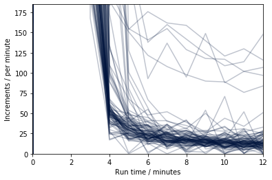
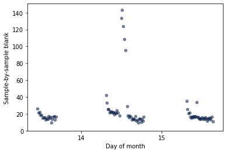

# koolstof

[](https://badge.fury.io/py/koolstof)
[](https://travis-ci.org/mvdh7/koolstof)

[](https://www.gnu.org/licenses/gpl-3.0)
[](https://github.com/psf/black)

Miscellaneous tools for marine carbonate chemistry and other delights.

Highly unstable and unreliably documented.

**Install:**

    pip install koolstof

**Import:**

```python
import koolstof as ks
```

## ks

Miscellaneous functions at the top level.

### ks.sigfig

Round [NumPy array](https://numpy.org/doc/stable/reference/generated/numpy.array.html?highlight=array#numpy.array) `x` to `sf` significant figures.

```python
x = ks.sigfig(x, sf)
```


## ks.vindta

Import and parse the data files produced by the [Marianda VINDTA 3C](http://www.marianda.com/index.php?site=products&subsite=vindta3c).

**This module is totally unofficial and in no way endorsed by Marianda!**

### ks.vindta.read_dbs

Import a VINDTA .dbs file as a [Pandas DataFrame](https://pandas.pydata.org/pandas-docs/stable/reference/api/pandas.DataFrame.html).

```python
dbs = ks.vindta.read_dbs(filepath)
```

### ks.vindta.addfunccols

Append new columns to a [Pandas DataFrame](https://pandas.pydata.org/pandas-docs/stable/reference/api/pandas.DataFrame.html) `df` containing the results of `df.apply(func)`.

```python
df = ks.vindta.addfunccols(df, func, *args)
```

The function input should have the signature `func(x, *args)` where `x` refers to each row of `df`.

### ks.vindta.read_logfile

Import a VINDTA logfile.bak as a [Pandas DataFrame](https://pandas.pydata.org/pandas-docs/stable/reference/api/pandas.DataFrame.html).

```python
logfile = ks.vindta.read_logfile(filepath, methods=['3C standard'])
```

Optional input `methods` allows you to specify your own set of method file names that should be treated as DIC samples, as a list of strings excluding the .mth extension.

### ks.vindta.logfile2dbs

Get the iloc index in `logfile` corresponding to each row in a `dbs` by matching both the bottle name and analysis time.

```python
dbs = ks.vindta.logfile2dbs(dbs, logfile)
```

### ks.vindta.get_blanks

Calculate the sample-by-sample blank values from the logfile.

**You must first run `ks.vindta.logfile2dbs()` to get the field `logfile_iloc` in `dbs`!**

```python
dbs = ks.vindta.get_blanks(dbs, logfile, usefrom=6)
```

`usefrom` determines which minute of each coulometric analysis to start measuring the blank from. You could use `ks.vindta.plot.increments()` to help decide what value to use here.

## ks.vindta.plot

Quickly make some standard figures that assist with calibrating and QCing VINDTA datasets.

You must first create your own axes to plot onto and to pass into these functions as the input `ax`, e.g.:

```python
from matplotlib import pyplot as plt
fig, ax = plt.subplots()
```

### ks.vindta.plot.increments

Plot coulometer increments minute-by-minute for all samples that appear in both the `dbs` and the `logfile`.

**You must first run `ks.vindta.logfile2dbs()` to get the field `logfile_iloc` in `dbs`!**

```python
ax = ks.vindta.plot.increments(ax, dbs, logfile, c='xkcd:navy', alpha=0.25, **kwargs)
```

Any additional `kwargs` are passed on to `plt.plot` to generate the plotted lines.

> Example figure:
>
> 

### ks.vindta.plot.blanks

Plot sample-by-sample coulometer blank values against analysis date.

**You must first run `ks.vindta.get_blanks()` to calculate the sample-by-sample blank values!**

```python
ax = ks.vindta.plot.blanks(ax, dbs, c='xkcd:navy', alpha=0.5, **kwargs)
```

Any additional `kwargs` are passed on to `plt.scatter` to generate the plotted data points.

> Example figure:
>
> 
